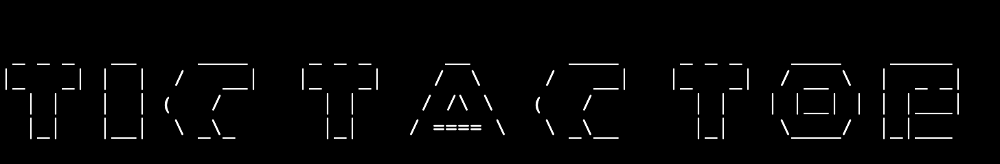
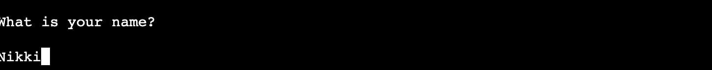
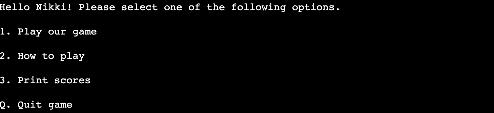
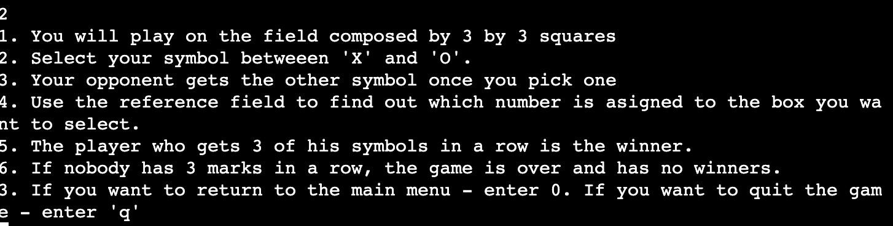
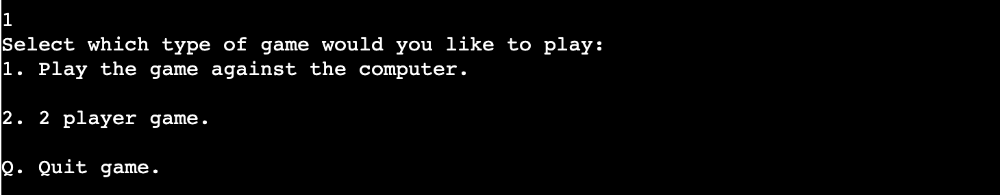
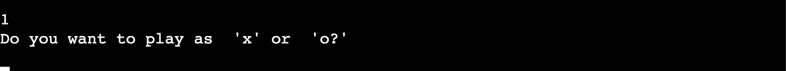

# TicTacToe 

**[Live site](https://tictactoegamenikki.herokuapp.com/)**

TicTacToe or Xs and Os is a 2 player game in which the players seek in alternate turns to complete a column, row or a diagonal with three O's or X's drawn in the empty spaces of a grid of 9 Squares. 

## Table of contents
- <a href="#howtoplay">How to play</a>
- <a href="#features">Features</a>
  - <a href="#actual-features">Actual Features</a>
  - <a href="#potential-features">Potential Features</a>
- <a href="#ux">UX</a>
  - <a href="#strategy">STRATEGY</a>
     - <a href="#ux-stories">User stories</a>
     - <a href="#project-goals">Project goals</a>
     - <a href="#user-goals">User goals</a>
     - <a href="#owner-goals">Game owner goals</a>
  - <a href="#scope">SCOPE</a>
  - <a href="#structure">STRUCTURE</a>
  - <a href="#skeleton">SKELETON</a>
     - <a href="#flowchart">Flow Chart</a>
- <a href="#technologies">Technologies Used</a>
- <a href="#testing">Testing</a>
  - <a href="#validator-testing">Manual</a>
  - <a href="#testing-unresolved">Unsolved bugs</a>
  - <a href="#testing-bugs">Known bugs</a>
- <a href="#deployment">Deployment</a>
  - <a href="#github">Github settings</a>
  - <a href="#heroku">Heroku </a>
- <a href="#credits">Credits</a>

<a style="text-align:right" href="#top">Go to table of contents :arrow_double_up:</a>

## How to play?
* The game is played on a grid of 3 by 3 squares. 
* You have the option to pick to play against the computer or a second player. 
* If you select X, your opponent will play as O. 
* Players take turns putting their symbols in empty squares. 
* The first player to get 3 marks in a row : up, down, across or diagonally is the winner.
* If no one gets the 3 marks in a row and the 9 squares are full, the game is over with no winners. 

<a style="text-align:right" href="#top">Go to table of contents :arrow_double_up:</a>

## Actual features

### 1. Game name
The first feature of the game is its name, it prints out when the program starts. 

### 2. Username

Once the game starts, the user inputs their name and the data is stored in our spreadsheet. 

### 3. Main page
Once you input your name, the main page of the game gets printed with the options: play, how to play, your scores, quit game.

### 4. How to play
On this page, you will have step-by-step instructions on how to play the game, how to pick the symbol, what does the grid consist of and you will also be able to return to the main menu or quit the game. 

### 5. Play game
If you select 1. in the main page, it will redirect you to the next page, where you need to select the type of game: vs computer or vs a 2nd player if you want to play with your friend. You can also quit the game from this menu. 

### 6. Select symbol
As soon as you have selected the game type, you are asked to select the symbol you would like to play as: "X" or "O". 

### 7. THE GAME
After you select the symbol, you are welcomed to the game field. 

There are 2 game types, please see below.

### 8. Game against computer
In this game, the player gets the first turn to place a symbol using the reference field. The computer then generates randomly a square choice and it gets printed. 

### 9. Game against 2nd player
In the game vs 2nd player, the first player goes first to place a symbol using the reference field numbers. As soon as the first player places his/her symbol, 2nd player's takes turn to place one. 

### 10. Your scores

### 11. Quit game

### 12. Google sheet

## Potential features

<a style="text-align:right" href="#top">Go to table of contents :arrow_double_up:</a>

# UX

## 1. STRATEGY

### User stories:

As a user, I want to:
* select the type of game: vs computer or vs second player. 
* have access to how to play instructions
* view my score 
* easily navigate throughout the menu
* be able to quit the game
* input a username

### Project goals:
The primary goals of TicTacToe is to entertain its users, to be a user friendly platform with an intuitive flow which allows its users to play the game easily, see their score, select the type of game and finally, quit the game. 

### User goals:
The user is looking for :
* an online tictactoe game to play against the computer or a friend, which easy to use and has an intuitive flow. 

The target user is:
* Age: 12+
* People playing online games

### Game owner goals:
* Provide a free, easy to use online game. 
* Collect data from all users: username, number of tries, number of games won, lost or draw. 

<a style="text-align:right" href="#top">Go to table of contents :arrow_double_up:</a>

## 2. SCOPE
The features of TICTACTOE include:
* the main game menu
* 2 game types: vs computer/second player
* the how to play section 
* a section that prints out the scores
* ability to quit the game

<a style="text-align:right" href="#top">Go to table of contents :arrow_double_up:</a>

###  Game name
### Username input
### Game menu
### Game type : vs computer/ 2nd player
### Select symbol
###  Game vs computer
###  Game vs player
###  Game over
###  Game quit
###  How to play section
### Print scores section
###  Google spreadhseet 

<a style="text-align:right" href="#top">Go to table of contents :arrow_double_up:</a>

## 4. SKELETON

## Flow Chart
Before starting the game, I have created the structure in the following chart I have made using [Lucid Charts](https://www.lucidchart.com/pages/). The chart initially did not have all the features I eventually included in the app, only the game and the how to play section. I have added the 'print scores' section while working on the game. 

<a style="text-align:right" href="#top">Go to table of contents :arrow_double_up:</a>

# Deployment

## Github settings

## Heroku
In order to deploy TicTacToe, I have used Heroku:
1. Logged into my account.
2. In the top right corner, I have clicked the button : New.
3. I the drop-down menu, I selected : Create new app.
4. I entered the name: tictactoegamenikki and selected Europe as the region. 
5. After inputting my name and region, I clicked on : Create App. 
6. After creating the app, I have clicked on the Settings button and scrolled down to : Config Vars. 
7. Then, I clicked the Reveal Config Vars and created 2 keys.
8. In the first 'KEY', I typed PORT and added '8000' as its value. Then, I clicked on the ADD button. 
9. I then created another 'KEY' for the credentials. 
10. Afterwards, in the Buildpacks, I added python and node.js. P.S: PYTHON MUST BE ON TOP. 
11. I then selected the Deploy tab in the dashboard and selected 'Github' as the deployment method. 
12. I connected my GitHub account and searched for the repository name. 
13. Finally, I connected the repo and selected the manual method for Deployment.

