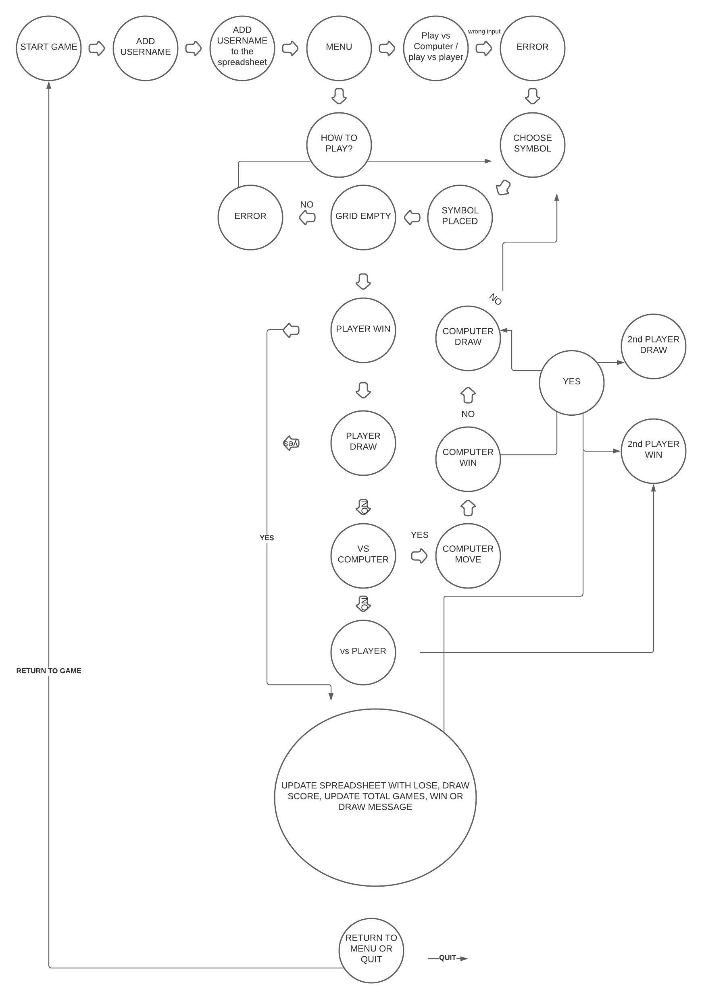

# TicTacToe 

**[Live site]()**

TicTacToe or Xs and Os is a 2 player game in which the players seek in alternate turns to complete a column, row or a diagonal with three O's or X's drawn in the empty spaces of a grid of 9 Squares. 

## Table of contents
- <a href="#howtoplay">How to play</a>
- <a href="#ux">UX</a>
  - <a href="#ux-stories">User stories</a>
- <a href="#flowchart">Flow Chart</a>
- <a href="#features">Features</a>
  - <a href="#features-all">Game</a>
  - <a href="#features-future">Potential Features</a>
- <a href="#technologies">Technologies Used</a>
- <a href="#testing">Testing</a>
  - <a href="#testing-manual">Manual</a>
  - <a href="#testing-unresolved">Unsolved bugs</a>
  - <a href="#testing-bugs">Known bugs</a>
- <a href="#deployment">Deployment</a>
- <a href="#credits">Credits</a>

<a style="text-align:right" href="#top">Go to table of contents :arrow_double_up:</a>

## How to play?

<a style="text-align:right" href="#top">Go to table of contents :arrow_double_up:</a>

## UX

### User stories

As a user, I want to:
* select the type of game: vs computer or vs second player. 
* have access to how to play instructions
* view my score 
* easily navigate throughout the menu
* be able to quit the game
* input a username

